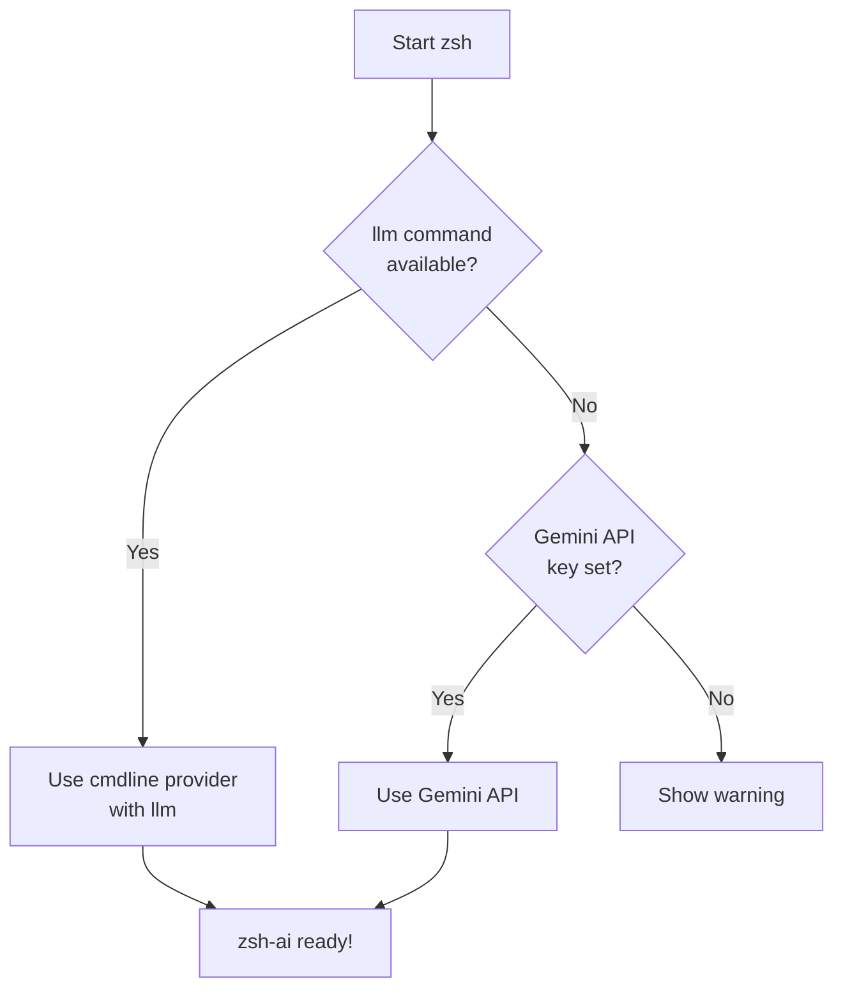

# 🚀 Quick Start: API Keys with yadm Encryption

## TL;DR

Your zsh-ai API keys are encrypted using **yadm's built-in GPG encryption**. This keeps them secure in your public dotfiles repository.

## 📋 Current Setup Status

Run this to check your current status:
```bash
~/.config/yadm/private/test-zsh-ai-provider.sh
```

## 🎯 First Time Setup

### Step 1: Create Your API Keys File

```bash
# Copy the template
cp ~/.config/yadm/private/api-keys.zsh.template ~/.config/yadm/private/api-keys.zsh

# Edit and add your Gemini API key (if needed)
vim ~/.config/yadm/private/api-keys.zsh
```

**Note**: You only need the Gemini API key if `llm` command is not available.

### Step 2: Encrypt and Commit

```bash
# Use the helper script
~/.config/yadm/private/encrypt-and-commit.sh

# Or manually:
yadm encrypt
yadm add ~/.local/share/yadm/archive
yadm commit -m "Add encrypted API keys"
yadm push
```

Done! Your API keys are now encrypted and stored securely.

## 🖥️ Setting Up a New Machine

### Step 1: Clone Your Dotfiles

```bash
yadm clone <your-repo-url>
yadm bootstrap
```

### Step 2: Decrypt Your Keys

```bash
# Use the helper script
~/.config/yadm/private/decrypt-keys.sh

# Or manually:
yadm decrypt
```

Enter your GPG password when prompted.

### Step 3: Verify and Use

```bash
# Check which provider will be used
~/.config/yadm/private/test-zsh-ai-provider.sh

# Test zsh-ai
exec zsh
# list all python files
```

## 🔄 Updating Your API Keys

```bash
# 1. Edit the keys
vim ~/.config/yadm/private/api-keys.zsh

# 2. Re-encrypt and commit
~/.config/yadm/private/encrypt-and-commit.sh

# 3. Push
yadm push
```

## 🔍 What's Encrypted?

The file `~/.config/yadm/encrypt` lists what gets encrypted:

```
.config/yadm/private/api-keys.zsh
```

The encrypted archive is stored at: `~/.local/share/yadm/archive`

## 🔐 Security Features

✅ **GPG Encryption** - Your keys are encrypted with your GPG key
✅ **Excluded from Git** - Plaintext keys never get committed (via `.gitignore`)
✅ **Encrypted Archive Tracked** - Only the encrypted file is in your repo
✅ **No Separate Repo Needed** - Everything in one dotfiles repository

## 🛠️ Helper Scripts

| Script | Purpose |
|--------|---------|
| `encrypt-and-commit.sh` | Encrypt and commit your API keys |
| `decrypt-keys.sh` | Decrypt keys on a new machine |
| `test-zsh-ai-provider.sh` | Check which provider zsh-ai will use |

All located in: `~/.config/yadm/private/`

## 🤔 How Provider Selection Works



### Priority Order:
1. **llm command** (if installed) → Uses local tool
2. **Gemini API** (if key is set) → Uses API fallback
3. **Warning** (if neither available) → Prompts for setup

## 📚 Full Documentation

- [Complete README](README.md) - Detailed encryption and setup guide
- [API Keys Template](api-keys.zsh.template) - Format for your keys
- [yadm Encryption Docs](https://yadm.io/docs/encryption) - Official yadm docs

## 💡 Pro Tips

1. **Install `llm` for best experience**: `pip install llm`
2. **Backup your GPG key** - You'll need it to decrypt on new machines
3. **Use the helper scripts** - They handle all the encryption steps
4. **Test on a new machine** - Verify your setup works before you need it

## 🆘 Troubleshooting

### "GPG not found"
```bash
# macOS
brew install gnupg

# Linux
sudo apt install gnupg
```

### "Decryption failed"
- Make sure you're using the same GPG key
- Check you have the correct password
- Verify: `ls -la ~/.local/share/yadm/archive`

### "API keys not working"
```bash
# Verify the file exists and is sourced
cat ~/.config/yadm/private/api-keys.zsh
source ~/.zshrc.d/.zsh-ai
echo $GEMINI_API_KEY  # Should show your key
```

### Still stuck?
Run the test script for diagnostic info:
```bash
~/.config/yadm/private/test-zsh-ai-provider.sh
```

